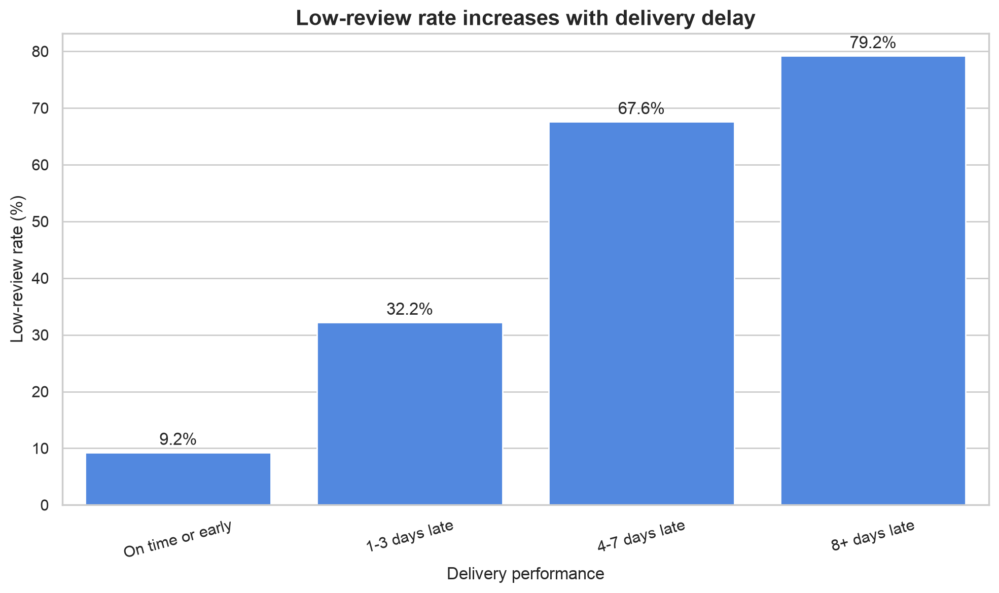
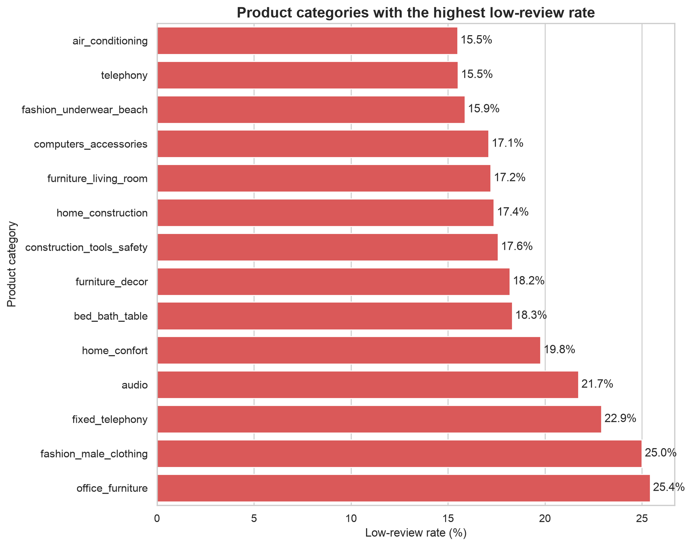
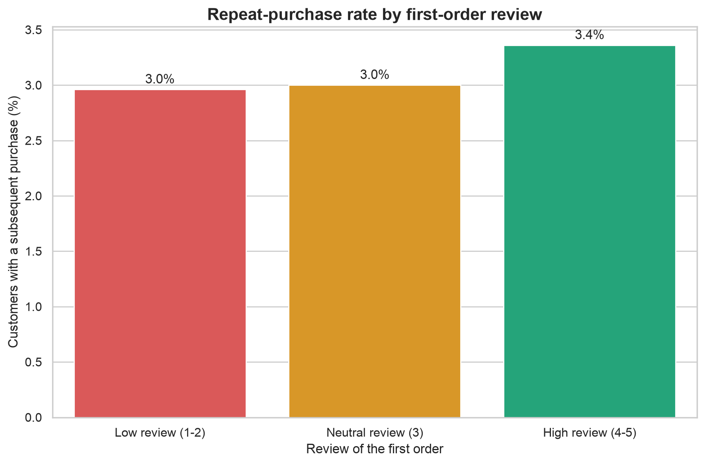
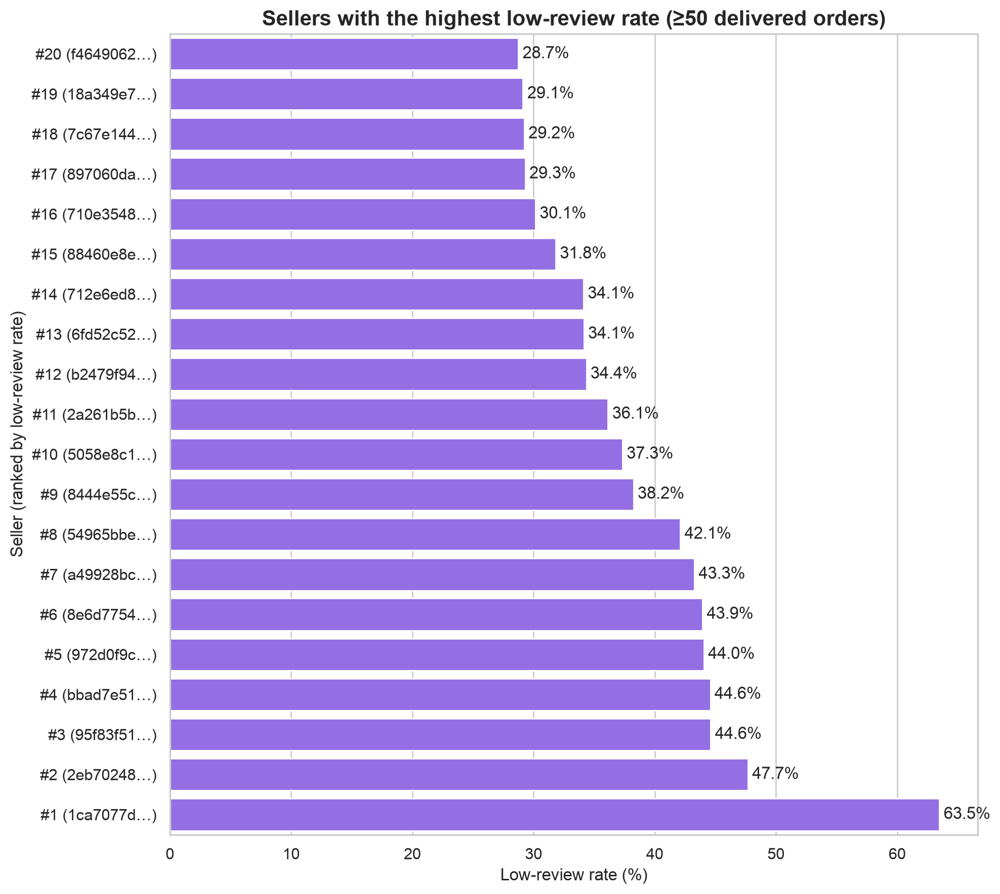

# Marketplace Customer Experience Analysis

## Business question

Which operational factors are associated with poor customer reviews, and how could a marketplace prioritize initiatives to improve customer experience and repeat purchasing?

## Executive summary

This project analyzes customer experience in the Olist marketplace dataset with a focus on operational drivers of poor reviews.

The strongest signal is delivery delay: low-review risk rises sharply as lateness increases. Extended checks show that this pattern persists after controlling for region, while category, order complexity, and seller-level differences act as secondary diagnostic signals. Retention effects after a poor first experience are directionally negative, but small and not strong enough to support a major business conclusion.

## Project overview

This project investigates how delivery performance, product category, and seller-level variation relate to customer satisfaction. The analytical focus is on four business questions:

1. Does delivery delay correlate with a higher share of low review scores?
2. Which product categories are associated with elevated customer dissatisfaction?
3. Are customers less likely to place another order after a poor first experience?
4. Which sellers show persistently elevated risk of poor customer outcomes?

Built in MySQL 8 and Python, with an order-level analytical view (`mart_order_fact`) as the basis for downstream analysis. MySQL 8 window functions support first-order and repeat-purchase logic.

## Dataset

**Brazilian E-Commerce Public Dataset by Olist** (Kaggle): ~100,000 orders with customers, products, order items, delivery timestamps, and review scores.

Required source files in `data/raw/`:

- `olist_orders_dataset.csv`
- `olist_order_items_dataset.csv`
- `olist_order_reviews_dataset.csv`
- `olist_customers_dataset.csv`
- `olist_products_dataset.csv`
- `product_category_name_translation.csv`

## Tech stack

- **Database:** MySQL 8
- **SQL:** CTEs, multi-table joins, aggregations, window functions
- **Python:** pandas, matplotlib, seaborn, scipy, statsmodels
- **Environment:** Jupyter Notebook
- **Version control:** Git, GitHub

## Repository structure

```text
marketplace-customer-experience-analysis/
├── README.md
├── requirements.txt
├── .gitignore
├── data/
│   ├── raw/
│   └── processed/
├── notebooks/
│   ├── 01_visualizations.ipynb
│   └── 02_hypothesis_tests.ipynb
├── scripts/
│   ├── export_extended_analysis.py
│   └── run_hypothesis_tests.py
├── outputs/
└── sql/
    ├── 00_create_database.sql
    ├── 01_create_tables.sql
    ├── 02_load_data.sql
    ├── 03_create_mart.sql
    ├── 04_quality_checks.sql
    ├── 05_analysis.sql
    └── 06_extended_analysis.sql
```

## Analytical approach

1. Import raw CSVs into MySQL 8.
2. Build order-level view `mart_order_fact`.
3. Validate granularity, missing values, and delivery-time ranges.
4. Run baseline analyses (delay, category, repeat purchase, seller risk).
5. Export outputs and build charts in `notebooks/01_visualizations.ipynb`.
6. Run extended robustness descriptors (`sql/06_extended_analysis.sql`) and formal hypothesis tests (`notebooks/02_hypothesis_tests.ipynb`).

The analytical unit is one order (`order_id`), which avoids row multiplication from item-level joins.

## Data quality checks

Before business analysis, `mart_order_fact` was validated for granularity and coverage.

- Exactly one row per order: **99,441** rows and **99,441** unique `order_id` values (**0** duplicates).
- Status mix dominated by **delivered** orders (**96,478**).
- Missing values relevant to CX analysis: **769** without review score, **2,965** without delivery date, **775** without item-level data.
- Delivery-time and delay ranges inspected before bucketing; review scores strongly skewed toward 5.

Analyses use **delivered orders with an available review score**.

## Key findings

- **Delivery delay dominates.** On-time/early orders have a **9.23%** low-review rate vs **79.18%** for orders **8+ days late** (monotonic rise across delay buckets; Cramér’s V ≈ 0.43).
- **Region does not explain delay away.** Late vs on-time low-review association persists within states (Mantel–Haenszel common OR ≈ 11.3).
- **Category and seller risk remain after logistics controls.** High-risk categories and sellers still show elevated low-review rates on on-time orders (e.g. office furniture ≈ 22% on-time).
- **Order complexity is a secondary operational signal.** Multi-item orders have substantially higher low-review risk (OR ≈ 2.9), including after late-delivery stratification.
- **Retention is a weak signal.** First-order low vs high review differs by < **0.5 pp** in repeat-purchase rate (~3% absolute); H10 is not significant at α = 0.05.

Details and full metrics: [`sql/05_analysis.sql`](sql/05_analysis.sql), [`sql/06_extended_analysis.sql`](sql/06_extended_analysis.sql), [`notebooks/02_hypothesis_tests.ipynb`](notebooks/02_hypothesis_tests.ipynb).

## Business interpretation

**Delivery delay is the clearest operational lever** for customer dissatisfaction. Robustness checks support prioritizing logistics first: the late-delivery pattern holds inside regions, while freight-ratio effects are statistically detectable but tiny.

Category and seller diagnostics still matter once delivery is on time — pointing to product quality, packaging, or expectation setting. Multi-item / multi-seller complexity is a useful monitoring layer, with the caveat that reviews are order-level and attribution is imperfect.

First-order retention differences are directionally negative but too small to drive prioritization ahead of logistics.

## What each analysis measures

| Analysis | Measures |
|---|---|
| Delivery delay | Low-review rate and average score by delay bucket |
| Product category | Low-review rate by category (min. volume filter) |
| Repeat purchase | Repeat-purchase rate by first-order review group |
| Seller risk | Low-review rate and late-delivery rate for sellers with ≥50 orders |

## Extended hypotheses / robustness checks

H1–H4 are baseline descriptive associations. H5–H12 check whether conclusions hold after operational controls:

| Check | One-line takeaway |
|---|---|
| Region | Delay → low-review persists within states |
| Freight-ratio terciles | Tiny effect vs delay; not a priority |
| Order complexity | Multi-item risk remains after late strata |
| Category on-time only | Product/category signal with logistics held constant |
| Seller on-time | Seller heterogeneity remains without lateness |
| Retention timing | Small magnitude; interpret cautiously |

SQL: [`sql/06_extended_analysis.sql`](sql/06_extended_analysis.sql).  
Exports: [`data/processed/`](data/processed/) (`region_review_analysis.csv`, `freight_value_review_analysis.csv`, `order_complexity_analysis.csv`, `category_on_time_risk.csv`, `seller_on_time_risk.csv`, `retention_timing_analysis.csv`).

## Hypothesis testing approach

Formal tests in [`notebooks/02_hypothesis_tests.ipynb`](notebooks/02_hypothesis_tests.ipynb) (order-level data; α = 0.05). Tests are pre-specified by data type; effect size is reported alongside p-values.

| Hypothesis | Test | Effect size |
|---|---|---|
| H1 Delay bucket ↔ low-review | χ² + Cochran–Armitage | Cramér’s V ≈ 0.43 |
| H5 State ↔ low-review | χ² | Cramér’s V ≈ 0.09 |
| H5b Late ↔ low-review \| state | Mantel–Haenszel | Common OR ≈ 11.3 |
| H6/H7 Freight-ratio tercile | χ² + Cochran–Armitage | Cramér’s V ≈ 0.015 |
| H8 Multi-item ↔ low-review | χ² + Mantel–Haenszel by late | OR ≈ 2.9 |
| H9 Category ↔ low-review (on-time) | χ² + BH-FDR (vs rest) | Cramér’s V ≈ 0.09 |
| H12 Seller ↔ low-review (on-time) | χ² | Cramér’s V ≈ 0.18 |
| H10 First review ↔ repeat purchase | χ² | Δ ≈ 0.41 pp (n.s. at 0.05) |
| H11 Days to repurchase | Kruskal–Wallis / Mann–Whitney | Cliff’s δ ≈ −0.16 |

Audit table: [`data/processed/hypothesis_test_summary.csv`](data/processed/hypothesis_test_summary.csv).

## Recommendations

1. **Reduce delivery lateness first** — largest effect size; persists within states; risk jumps sharply after 3+ days late.
2. **Audit high-risk categories on on-time orders** — e.g. office furniture, fashion male clothing, fixed telephony.
3. **Monitor complexity and seller on-time risk** as diagnostic layers for ops / quality programs.
4. **Treat first-order retention as a weak secondary signal** — absolute repeat-purchase rates are ~3%.

## Future extensions

Possible next steps beyond the current scope:

1. Load payment data to test payment-type friction against low-review risk.
2. Use geolocation to measure seller–customer distance as a driver of delay.
3. Fit a simple low-review risk model to rank feature importance after the hypothesis layer.

## Data dictionary

Columns in `mart_order_fact` (one row per `order_id`), matching [`sql/03_create_mart.sql`](sql/03_create_mart.sql):

| Column | Description |
|---|---|
| `order_id` | Order identifier |
| `customer_unique_id` | Persistent customer identifier |
| `customer_state` | Customer state code |
| `order_status` | Order status (e.g. delivered) |
| `order_purchase_timestamp` | Purchase timestamp |
| `order_delivered_customer_date` | Actual delivery timestamp |
| `order_estimated_delivery_date` | Estimated delivery timestamp |
| `item_count` | Number of items in the order |
| `seller_count` | Number of distinct sellers in the order |
| `item_revenue` | Sum of item prices |
| `freight_revenue` | Sum of freight values |
| `order_gmv` | `item_revenue` + `freight_revenue` |
| `categories` | Distinct product categories in the order (comma-separated) |
| `review_score` | Average review score for the order (1–5) |
| `delivery_days` | Days from purchase to delivery |
| `delivery_delay_days` | Days from estimated to actual delivery (negative = early) |
| `is_late_delivery` | 1 if delivered after the estimate; else 0 (null if undelivered) |
| `is_low_review` | 1 if `review_score` ≤ 2; else 0 (null if no review) |

## Visualizations

Baseline charts from [`notebooks/01_visualizations.ipynb`](notebooks/01_visualizations.ipynb):

1. Low-review rate by delivery-delay bucket
2. Categories with the highest low-review rate
3. Repeat-purchase rate by first-order review group
4. Sellers with the highest low-review rate

Significance-annotated charts from [`notebooks/02_hypothesis_tests.ipynb`](notebooks/02_hypothesis_tests.ipynb): `outputs/h1_delay_significance.png`, `outputs/h6_freight_significance.png`, `outputs/h10_retention_significance.png`.

### Figures









## Main SQL concepts demonstrated

- multi-table `JOIN`, CTEs, aggregations, `HAVING`
- delivery-time calculations with date functions
- window functions (`ROW_NUMBER()`, `LEAD()`)
- order-level analytical mart for downstream analysis
- seller-level and stratified robustness metrics (`06_extended_analysis.sql`)

## Limitations

- Observational associations only; significance tests do not establish causality.
- Missing review scores may introduce selection bias.
- Review score is order-level, not item-level; multi-item / multi-seller attribution is imperfect.
- Repeat-purchase analysis uses a purchase-date cutoff; absolute rates are low, so small gaps are hard to detect.
- Days-to-repurchase tests cover repeaters only (not a full survival model).
- Historical Brazilian marketplace — do not generalize directly to another platform.

## Reproduction steps

1. Download the Olist files from Kaggle into `data/raw/`.
2. `pip install -r requirements.txt`
3. Run SQL scripts in order:

```text
00_create_database.sql
01_create_tables.sql
02_load_data.sql
03_create_mart.sql
04_quality_checks.sql
05_analysis.sql
06_extended_analysis.sql
```

4. Export extended descriptors (CSV path, no DB required):

```text
python scripts/export_extended_analysis.py
```

5. Run hypothesis tests:

```text
python scripts/run_hypothesis_tests.py
```

   Or open `notebooks/02_hypothesis_tests.ipynb` (defaults to raw CSVs; set `MYSQL_USER` / `MYSQL_PASSWORD` to query `mart_order_fact`).

6. Run `notebooks/01_visualizations.ipynb` for baseline charts.

## Why this project matters

This is a product/data analytics portfolio piece, not a generic SQL exercise: a clear business question, data-quality validation before interpretation, robustness checks beyond raw correlations, and recommendations a marketplace could prioritize.
